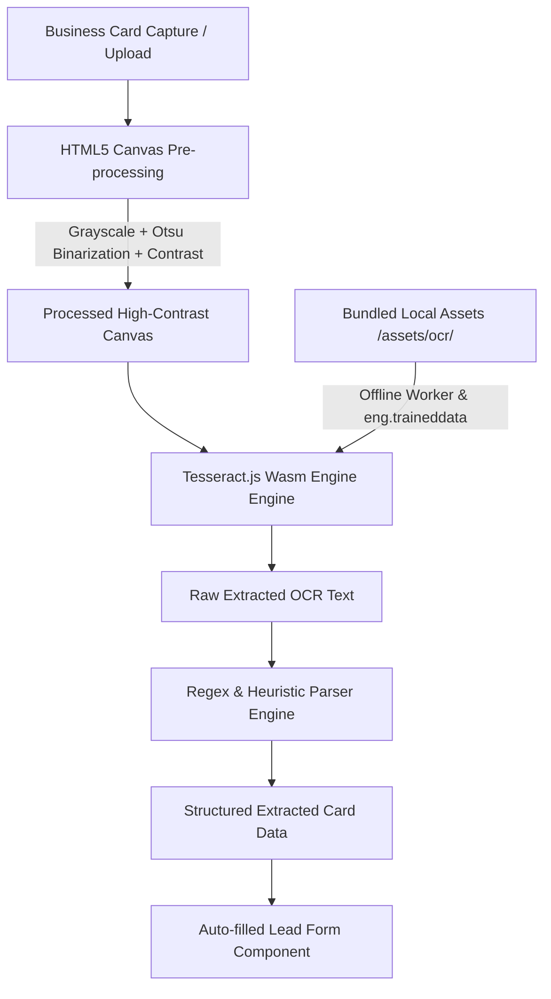

# 100% Offline & Free Business Card OCR Implementation Plan

This document outlines the complete technical blueprint for implementing a **100% offline, privacy-first, zero-cost Business Card OCR and Contact Parsing engine** for the Exhibition Leads Management system.

---

## User Review Required

> [!IMPORTANT]
> **Key Architecture Decisions:**
> 1. **Zero External API Dependencies**: The OCR engine runs entirely in the user's web browser using **Tesseract.js WebAssembly (Wasm)**. No cloud services (Google Vision, AWS Textract, Azure AI) are required, guaranteeing 100% offline capability and zero operational cost.
> 2. **Local Asset Bundling**: Language training data (`eng.traineddata.gz`), Web Worker scripts, and Wasm binaries will be bundled into `src/assets/ocr/`. This ensures the application works seamlessly without an internet connection or CDN dependency.
> 3. **Smart Client-Side Heuristic Parsing**: Extracted raw text is automatically parsed into structured fields (**Full Name, Job Title, Company Name, Mobile Number, Email, Website**) using client-side regular expressions and named-entity heuristics.

---

## Technical Architecture Overview

---

## Proposed Changes

### Component: Frontend OCR Engine (`frontend/src/app/features/lead-capture/`)

#### [NEW] [ocr-preprocessor.service.ts](file:///d:/AriyAI/exhibition%20leads%20management/frontend/src/app/core/services/ocr-preprocessor.service.ts)
- Implement client-side image enhancement pipeline using HTML5 Canvas:
  - **Grayscale Conversion**: Eliminates color noise from business card backgrounds.
  - **Adaptive Binarization / Contrast Boost**: Converts text to crisp black-and-white for maximum Tesseract OCR accuracy.
  - **Canvas Rescaling**: Auto-scales small camera captures to optimal DPI (300 DPI equivalent) for OCR processing.

#### [NEW] [card-parser.service.ts](file:///d:/AriyAI/exhibition%20leads%20management/frontend/src/app/core/services/card-parser.service.ts)
- Implement regex and rule-based heuristic extractor for OCR text:
  - **Email Parsing**: Pattern matching for standard email formats.
  - **Phone Number Parsing**: Multi-pattern regex for international (`+91`, `+1`), national, landline, and formatted numbers.
  - **Website URL Parsing**: Regex matching for domains, `www.`, and `http/https` schemes.
  - **Designation / Job Title Detection**: Keyword dictionary matching (`Manager`, `Director`, `Founder`, `CEO`, `VP`, `Engineer`, `Consultant`, `Developer`, `Sales`, `Specialist`, etc.).
  - **Company Name Extraction**: Pattern recognition based on entity indicators (`Pvt`, `Ltd`, `Inc`, `Corp`, `Technologies`, `Solutions`, `Group`, `Enterprises`, `Software`, `Industries`) and text position.
  - **Full Name Extraction**: Heuristic scoring evaluating line position, capitalized token count, exclusion of phone/email/company lines, and title salutations (`Mr.`, `Ms.`, `Dr.`).

#### [MODIFY] [ocr-scanner.component.ts](file:///d:/AriyAI/exhibition%20leads%20management/frontend/src/app/features/lead-capture/ocr-scanner.component.ts)
- Upgrade component from mock timer simulation to real local `tesseract.js` worker instance.
- Add visual image pre-processing preview (Original Card vs. Enhanced High-Contrast Card).
- Implement interactive field confirmation UI:
  - Shows extraction confidence score per field.
  - Allows quick manual edits before emitting data to `lead-form.component.ts`.
- Integrate progress indicator showing Tesseract Wasm loading, image processing, and text parsing steps.

#### [NEW] Assets Configuration (`frontend/src/assets/ocr/`)
- Download and bundle local offline assets into Angular assets directory:
  - `worker.min.js`: Tesseract Web Worker script.
  - `tesseract-core.wasm`: WebAssembly core binary.
  - `eng.traineddata.gz`: Fast English language OCR dataset (~1.5 MB).
- Configure Angular build config `angular.json` to copy assets to root distribution folder.

---

## Verification Plan

### Automated Tests
- Create unit tests for `card-parser.service.ts` testing extraction accuracy against sample business card raw text strings (`npm run test`).
- Test edge cases: cards with missing email, multi-line phone numbers, complex job titles, and stylized company names.

### Manual Verification
1. **Offline Mode Test**: Disconnect network / enable Chrome DevTools "Offline" mode.
2. **Camera Scan & Upload Test**: Upload diverse business card images (JPG, PNG, WebP) and verify:
   - OCR runs without network calls.
   - Text is cleanly extracted and pre-processed.
   - Form fields (Name, Email, Phone, Company, Designation) auto-populate accurately in `lead-form.component.ts`.
